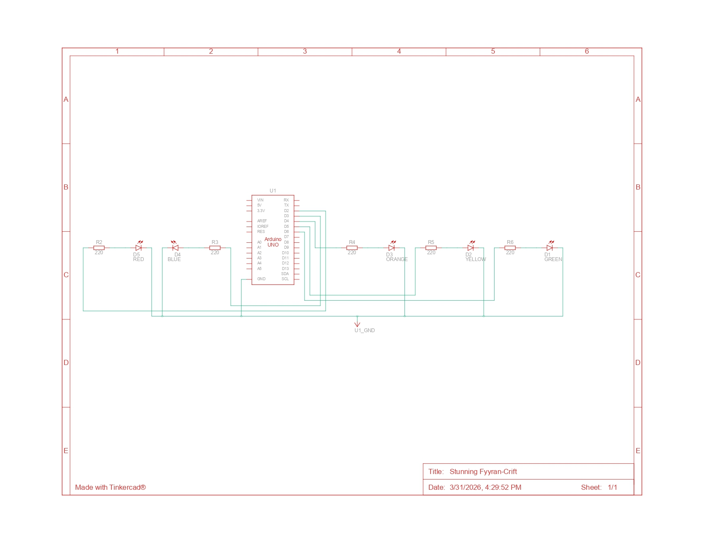

# Jawaban Praktikum 1.6.4 - Perulangan

## 1. Gambarkan rangkaian schematic 5 LED running


---

## 2. Bagaimana LED berjalan dari kiri ke kanan?
Efek ini dibuat menggunakan perulangan `for (int ledPin = 2; ledPin < 7; ledPin++)`. Program memulai dari pin digital 2, menyalakannya, memberi delay, mematikannya, lalu lanjut ke pin berikutnya (3, 4, 5, 6). Karena dilakukan berurutan secara cepat, LED terlihat seperti "berjalan".

---

## 3. Bagaimana LED berjalan dari kanan ke kiri?
Efek kembali dibuat dengan perulangan `for` menurun: `for (int ledPin = 7; ledPin >= 2; ledPin--)`. Operator `--` (decrement) menyebabkan variabel `ledPin` berkurang satu-satu dari pin 7 menuju pin 2, sehingga urutan nyala LED menjadi terbalik.

---

## 4. Program 3 LED kanan & kiri bergantian

### Kode Program
```cpp
int timer = 200;

void setup() {
  for (int i = 2; i <= 7; i++) {
    pinMode(i, OUTPUT);
  }
}

void loop() {
  digitalWrite(2, HIGH);
  digitalWrite(3, HIGH);
  digitalWrite(4, HIGH);
  delay(timer);

  digitalWrite(2, LOW);
  digitalWrite(3, LOW);
  digitalWrite(4, LOW);

  digitalWrite(5, HIGH);
  digitalWrite(6, HIGH);
  digitalWrite(7, HIGH);
  delay(timer);

  digitalWrite(5, LOW);
  digitalWrite(6, LOW);
  digitalWrite(7, LOW);
}
```

---

### Penjelasan Kode
- Mengatur kecepatan perpindahan LED.
- Menginisialisasi pin sebagai output.
- Menyalakan LED kiri lalu mematikannya.
- Menyalakan LED kanan lalu mematikannya.
- LED menyala bergantian terus-menerus.
