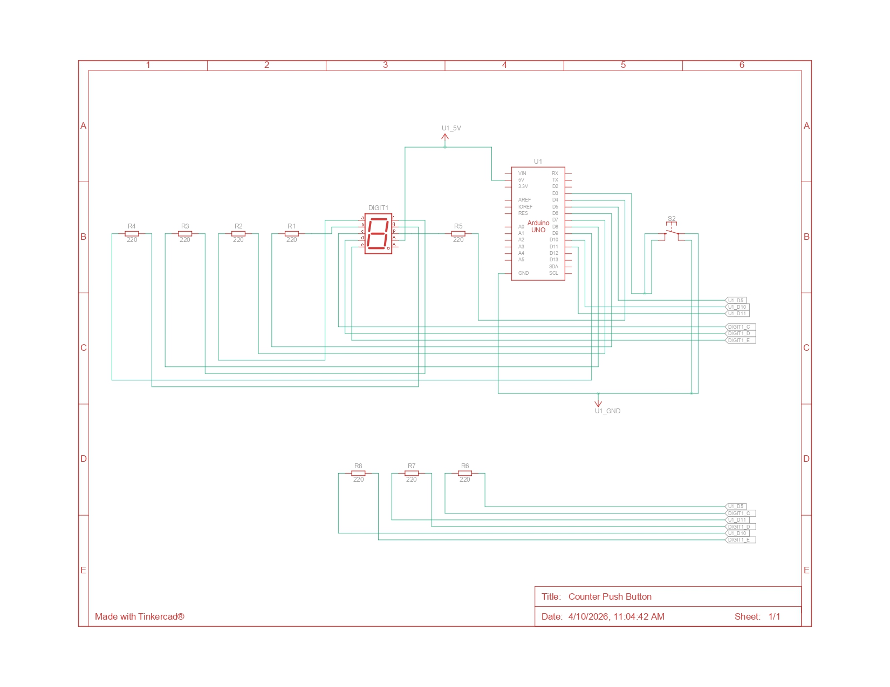

# Jawaban Praktikum 2.6.4: Kontrol Counter Push Button

## 1. Gambar Rangkaian Schematic


---

## 2. Mengapa menggunakan `INPUT_PULLUP`?
Mode `INPUT_PULLUP` mengaktifkan resistor internal di dalam mikrokontroler yang menghubungkan pin ke VCC.
**Keuntungannya:**
* **Efisiensi Komponen:** Kita tidak perlu memasang resistor fisik tambahan (external resistor) di breadboard.
* **Stabilitas Sinyal:** Mencegah kondisi "floating" (sinyal tidak menentu antara 0 dan 1) saat tombol tidak ditekan. Saat tombol tidak ditekan, pin bernilai HIGH. Saat ditekan, pin terhubung ke GND dan bernilai LOW.

---

## 3. Analisis LED Segmen Tidak Menyala
* **Sisi Hardware:**
    * Resistor putus atau kabel jumper kendor.
    * Salah satu segmen pada LED Seven Segment terbakar/rusak.
    * Kaki komponen tidak menancap sempurna di breadboard.
* **Sisi Software:**
    * Kesalahan pendefinisian array `segmentPins`.
    * Kesalahan logika pada `digitalPattern` (angka 0/1 tertukar).
    * Lupa mengatur `pinMode` sebagai `OUTPUT` pada fungsi `setup()`.

---

## 4. Modifikasi: Increment & Decrement (2 Tombol)

### Kode Program
```cpp
const int segmentPins[8] = {7, 6, 5, 11, 10, 8, 9, 4};
const int btnUp = 3;   // Tombol Tambah
const int btnDown = 2; // Tombol Kurang

byte digitalPattern[16][8] = {
  {1,1,1,1,1,1,0,0},
  {0,1,1,0,0,0,0,0},
  {1,1,0,1,1,0,1,0},
  {1,1,1,1,0,0,1,0},
  {0,1,1,0,0,1,1,0},
  {1,0,1,1,0,1,1,0},
  {1,0,1,1,1,1,1,0},
  {1,1,1,0,0,0,0,0},
  {1,1,1,1,1,1,1,0},
  {1,1,1,1,0,1,1,0},
  {1,1,1,0,1,1,1,0},
  {0,0,1,1,1,1,1,0},
  {1,0,0,1,1,1,0,0},
  {0,1,1,1,1,0,1,0},
  {1,0,0,1,1,1,1,0},
  {1,0,0,0,1,1,1,0}
};

int currentDigit = 0;

bool lastUpState = HIGH;
bool lastDownState = HIGH;

void displayDigit(int num)
{
  for(int i=0;i<8;i++)
  {
    digitalWrite(segmentPins[i], !digitalPattern[num][i]);
  }
}

void setup()
{
  for(int i=0;i<8;i++)
  {
    pinMode(segmentPins[i], OUTPUT);
  }

  // Input dengan resistor pull-up internal
  pinMode(btnUp, INPUT_PULLUP);
  pinMode(btnDown, INPUT_PULLUP); 
  
  displayDigit(currentDigit); // Tampilkan angka awal (0)
}

void loop() {
  bool upState = digitalRead(btnUp);
  bool downState = digitalRead(btnDown);

  // Logika Increment (Jika tombol Up ditekan)
  if(lastUpState == HIGH && upState == LOW)
  {
    currentDigit++;
    if(currentDigit > 15) currentDigit = 0; // Reset ke 0 jika lebih dari F
    displayDigit(currentDigit);
  }

  // Logika Decrement (Jika tombol Down ditekan)
  if(lastDownState == HIGH && downState == LOW)
  {
    currentDigit--;
    if(currentDigit < 0) currentDigit = 15; // Reset ke F jika kurang dari 0
    displayDigit(currentDigit);
  }

  lastUpState = upState;
  lastDownState = downState;
}
```