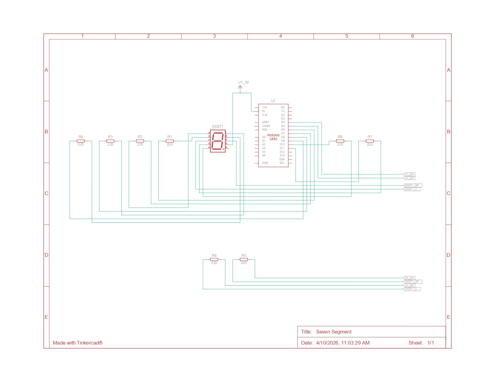

# Jawaban Praktikum 2.5.4: Seven Segment

## 1. Gambar Rangkaian Schematic


---

## 2. Apa yang terjadi jika nilai `num` lebih dari 15?
Jika nilai `num` melebihi 15, program akan mengalami **Array Out of Bounds**. Karena array `digitalPattern` hanya didefinisikan dengan ukuran `[16][8]`, memanggil index di atas 15 akan menyebabkan program mengambil data dari alamat memori yang tidak valid. Hal ini dapat menyebabkan tampilan segmen menjadi acak (glitch) atau program mengalami *crash*.

---

## 3. Jenis Seven Segment: Common Cathode atau Common Anode?
Program ini menggunakan jenis **Common Anode**.   
**Alasannya:**
Pada baris kode: `digitalWrite(segmentPins[i], !digitalPattern[num][i]);`.
Penggunaan operator NOT (`!`) membalikkan logika. Dalam array, angka `1` dimaksudkan untuk menyalakan LED. Namun, dengan operator `!`, nilai `1` berubah menjadi `0` (LOW). Pada Seven Segment **Common Anode**, LED menyala saat diberi sinyal **LOW** (GND), karena pin Common-nya sudah terhubung ke VCC (5V).

---

## 4. Modifikasi Program (F ke 0)

### Kode Program
```cpp
const int segmentPins[8] = {7, 6, 5, 11, 10, 8, 9, 4};

// Pattern untuk 0-F
byte digitalPattern[16][8] = {
  {1,1,1,1,1,1,0,0},
  {0,1,1,0,0,0,0,0},
  {1,1,0,1,1,0,1,0},
  {1,1,1,1,0,0,1,0},
  {0,1,1,0,0,1,1,0},
  {1,0,1,1,0,1,1,0},
  {1,0,1,1,1,1,1,0},
  {1,1,1,0,0,0,0,0},
  {1,1,1,1,1,1,1,0},
  {1,1,1,1,0,1,1,0},
  {1,1,1,0,1,1,1,0},
  {0,0,1,1,1,1,1,0},
  {1,0,0,1,1,1,0,0},
  {0,1,1,1,1,0,1,0},
  {1,0,0,1,1,1,1,0},
  {1,0,0,0,1,1,1,0}
};

// Gunakan ! agar nilai 1 di pattern menjadi LOW (menyalakan LED Common Anode)
void displayDigit(int num)
{
  for(int i=0;i<8;i++)
  {
    digitalWrite(segmentPins[i], !digitalPattern[num][i]);
  }
}

// Set semua pin segment sebagai output
void setup()
{
  for(int i=0;i<8;i++)
  {
    pinMode(segmentPins[i], OUTPUT);
  }
}

// Loop menurun dari index 15 (F) ke 0
void loop() {
  for(int i=15; i>=0; i--) {
    displayDigit(i);
    delay(1000);
  }
}
```